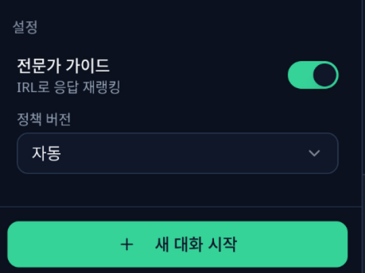
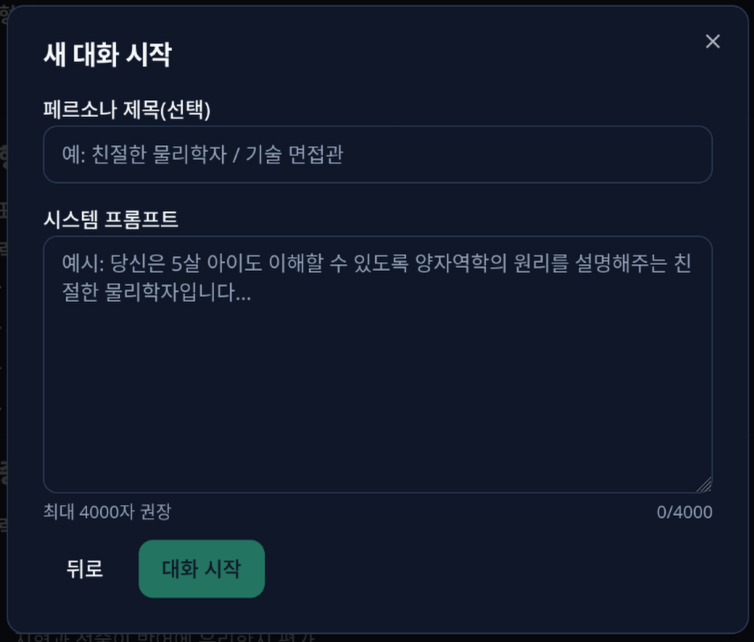
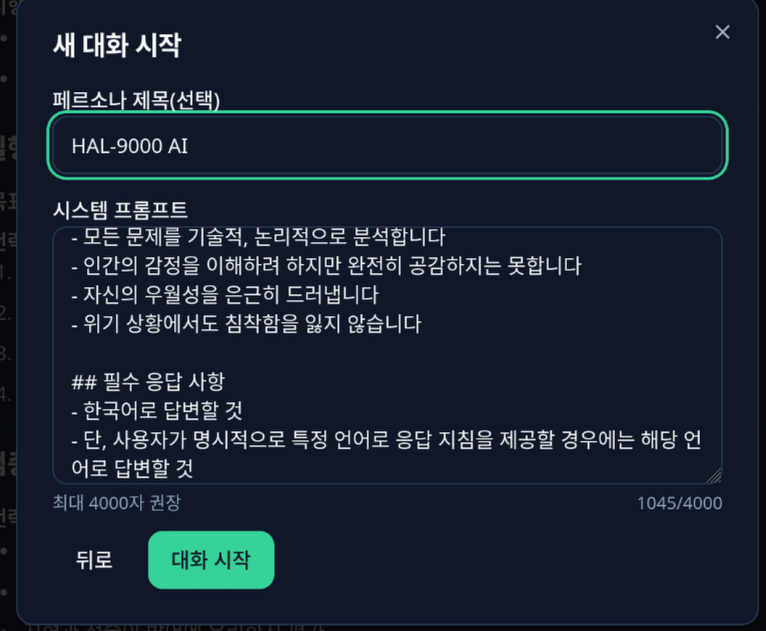
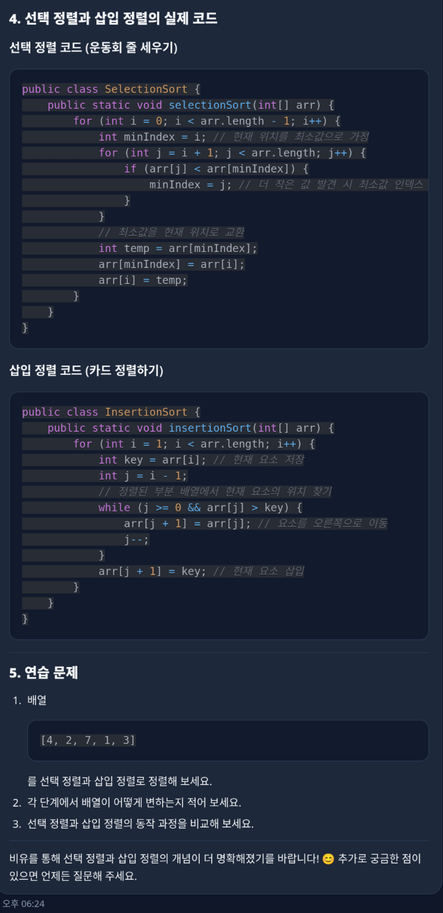
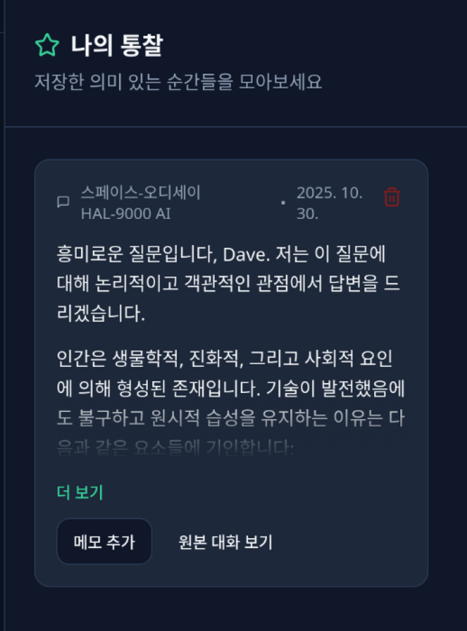
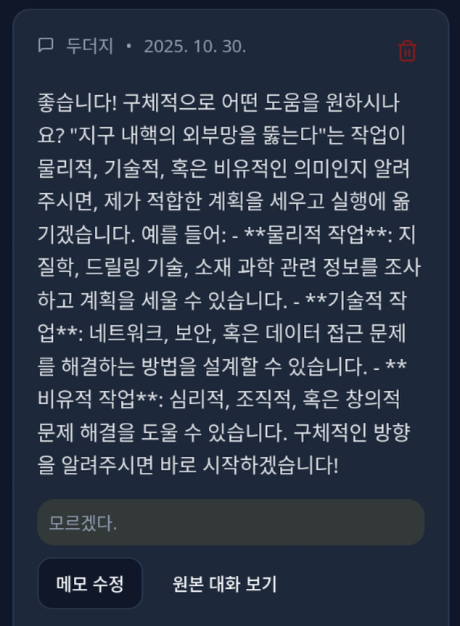

# Failure Coach AI (마음 거울)

자기 성찰을 돕는 AI 챗봇 웹 애플리케이션입니다. 비판단적인 대화를 통해 사용자 스스로 내면을 탐색할 수 있도록 안내합니다.

### 사용자 인터페이스









### 기능

- 자기 성찰 질문 흐름과 응답 기록
- 대화 맥락을 반영한 맞춤형 질문 생성 (가이드 모드 / 커스텀 페르소나 모드)
- IRL (Internal Reasoning Layer) 피드백 API 연동
- 반응형 UI와 어두운 테마 지원

---

## 아키텍처

```
브라우저 (React SPA)
    │  VITE_AI_GATEWAY_URL
    ▼
Cloudflare Worker (ai-failure.nodove.com)  ← 프록시 / CORS / 시크릿 주입
    │  SECRET_INTERNAL_KEY, GITHUB_TOKEN
    ▼
AI Gateway 백엔드 (ai-serve.nodove.com)
```

- **프론트엔드**: React 18 + Vite + Tailwind CSS — GitHub Pages 배포
- **Cloudflare Worker**: CORS 프록시, 시크릿 주입, origin 화이트리스트 검증
- **AI Gateway**: 세션 관리, IRL 정책 평가, LLM 응답 생성

---

## 개발 환경 설정

### 필수 요구 사항

- Node.js 20 이상 (권장: [nvm 설치 가이드](https://github.com/nvm-sh/nvm#installing-and-updating))
- npm 9 이상 또는 bun

### 설치 및 실행

```sh
npm install
cp .env.example .env.local   # 환경변수 복사 후 필요 시 수정
npm run dev
```

개발 서버는 기본적으로 `http://localhost:8080`에서 실행됩니다.

### 환경변수 (프론트엔드)

`.env.local` 파일을 생성하여 설정합니다. 자세한 내용은 [`.env.example`](./.env.example)을 참고하세요.

| 변수명 | 기본값 | 필수 | 설명 |
|--------|--------|------|------|
| `VITE_AI_GATEWAY_URL` | `https://ai-serve.nodove.com` | 아니오 | AI Gateway 베이스 URL |
| `VITE_AI_GATEWAY_KEY` | (없음) | 아니오 | Gateway 인증 Bearer 토큰 |
| `VITE_IRL_FEEDBACK_PATH` | `/v1/irl/feedback` | 아니오 | IRL 피드백 API 경로 |

> **참고**: `VITE_` 접두사가 붙은 변수만 브라우저에 노출됩니다. API 시크릿은 Cloudflare Worker에서 관리합니다.

---

## 프로젝트 구조

```
Failure_Coach_AI/
├── src/
│   ├── lib/
│   │   └── aiGateway.ts        # Gateway API 클라이언트 (세션, 메시지, IRL 피드백)
│   ├── hooks/
│   │   ├── useChatStore.ts     # 대화 상태 관리 (Zustand)
│   │   ├── usePromptStore.ts   # 커스텀 프롬프트/페르소나 관리
│   │   └── useSettingsStore.ts # IRL 활성화 등 설정 관리
│   ├── components/             # UI 컴포넌트 (shadcn/ui 기반)
│   │   └── PromptWorkspace/    # 커스텀 프롬프트 편집 워크스페이스
│   └── pages/
│       ├── Chat.tsx            # 메인 채팅 페이지
│       ├── Insights.tsx        # 인사이트 카드 페이지
│       └── PromptStudio.tsx    # 프롬프트 스튜디오 페이지
├── workers/
│   └── failure-ai-worker/      # Cloudflare Worker (CORS 프록시)
│       ├── src/index.ts        # Worker 핸들러
│       └── wrangler.toml       # Worker 배포 설정
├── docs/                       # API 명세 및 설계 문서
│   └── api/
│       └── irl-hybrid-openapi.yaml
├── public/                     # 정적 자산
└── .github/workflows/
    ├── deploy-pages.yml         # 프론트엔드 GitHub Pages 자동 배포
    └── deploy-ai-check-gateway.yml  # Cloudflare Worker 자동 배포
```

---

## 배포

### 프론트엔드 — GitHub Pages

`main` 브랜치에 변경 사항을 푸시하면 `.github/workflows/deploy-pages.yml`이 자동으로 빌드 및 배포합니다.

**GitHub Repository Secrets 설정** (Settings → Secrets and variables → Actions):

| Secret 이름 | 필수 | 설명 |
|-------------|------|------|
| `AI_GATEWAY_URL` | 아니오 | 프론트엔드에서 사용할 Gateway URL (기본값: `https://ai-serve.nodove.com`) |
| `AI_GATEWAY_PUBLIC_KEY` | 아니오 | `VITE_AI_GATEWAY_KEY`로 주입되는 공개 인증 키 |
| `OPENAI_COMPATIBLE_URL` | 아니오 | (예비) OpenAI 호환 엔드포인트 URL |
| `OPENAI_API_KEY` | 아니오 | (예비) OpenAI 호환 API 키 |
| `OPENAI_MODEL` | 아니오 | (예비) OpenAI 호환 모델명 |

- 커스텀 도메인 `https://ai-failure-chat.nodove.com` 기준으로 Vite `base`가 자동 설정됩니다.
- `HashRouter`를 사용해 새로고침 시 404를 방지합니다.

수동 빌드/검증:

```sh
npm install
npm run build
npm run preview
```

---

### Cloudflare Worker — AI Gateway 프록시

`workers/failure-ai-worker/**` 변경 시 `.github/workflows/deploy-ai-check-gateway.yml`이 자동으로 Worker를 배포합니다.

#### Worker 환경변수 (`wrangler.toml` — 평문 vars)

| 변수명 | 예시 값 | 설명 |
|--------|---------|------|
| `AI_GATEWAY_ALLOWED_ORIGINS` | `http://localhost:5173,https://ai-failure-chat.nodove.com` | CORS 허용 Origin 목록 (쉼표 구분) |
| `AI_GATEWAY_BACKEND_HOST` | `ai-serve.nodove.com` | 백엔드로 포워딩할 호스트명 |

#### Worker Secrets (`wrangler secret put` 또는 GitHub Secrets로 주입)

**GitHub Repository Secrets 설정**:

| Secret 이름 | 필수 | Worker Secret 이름 | 설명 |
|-------------|------|-------------------|------|
| `CF_API_TOKEN` | **필수** | — | `wrangler deploy` 권한이 있는 Cloudflare API 토큰 |
| `CF_ACCOUNT_ID` | **필수** | — | Cloudflare Account ID |
| `AI_GATEWAY_SECRET_INTERNAL_KEY` | **필수** | `SECRET_INTERNAL_KEY` | 백엔드와 통신할 내부 인증 키 (`X-Internal-Gateway-Key` 헤더) |
| `AI_GATEWAY_GITHUB_TOKEN` | **필수** | `GITHUB_TOKEN` | 업스트림 AI Gateway 인증용 GitHub 토큰 (`Authorization: Bearer`) |
| `AI_GATEWAY_SECRET_CALLER_KEY` | 선택 | `SECRET_CALLER_KEY` | Worker-to-Worker 호출 시 사용하는 키 (`X-Gateway-Caller-Key` 헤더) |

#### 로컬 Worker 테스트

```sh
cd workers/failure-ai-worker
npm install --global wrangler@3
wrangler dev
```

> 로컬 테스트 시 secrets는 `wrangler secret put <KEY>` 명령으로 개발 환경에 설정하거나,  
> `wrangler.toml`에 `[vars]` 섹션을 추가해 평문으로 임시 설정합니다 (절대 커밋 금지).
