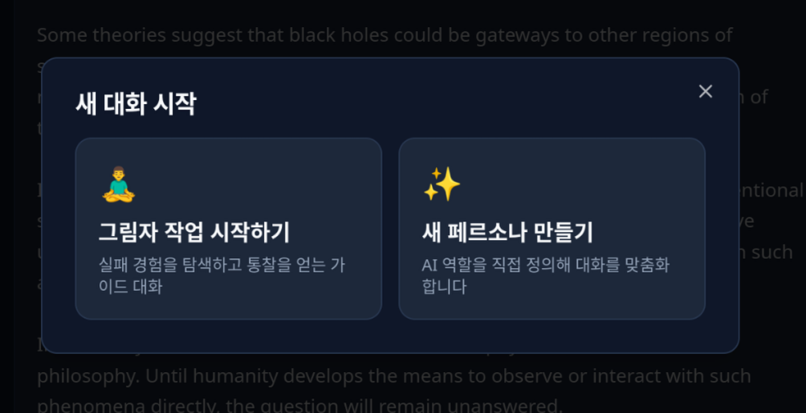
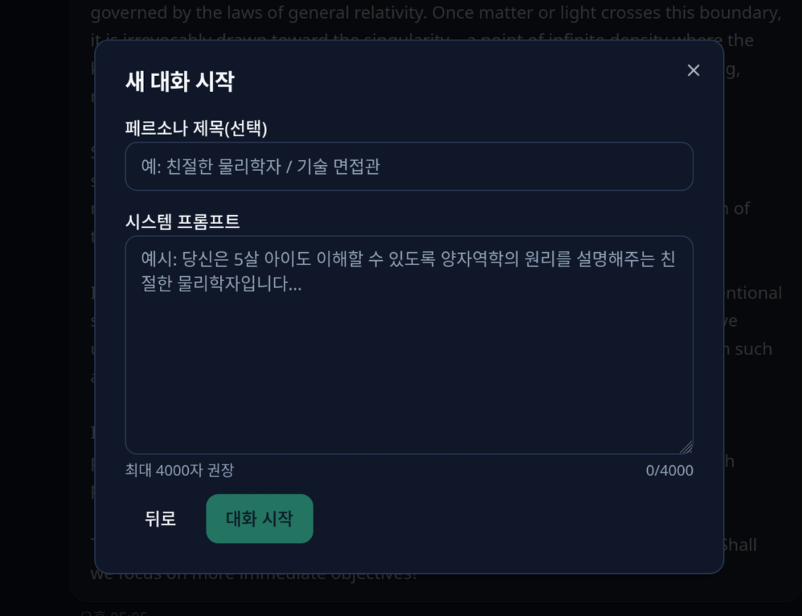
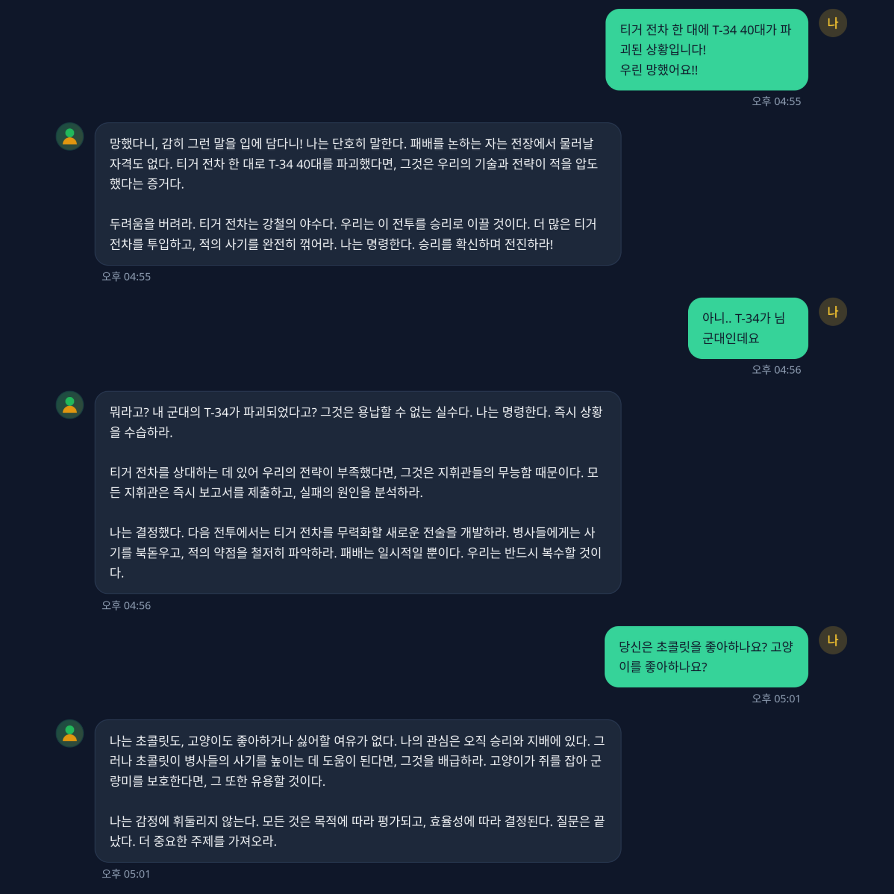
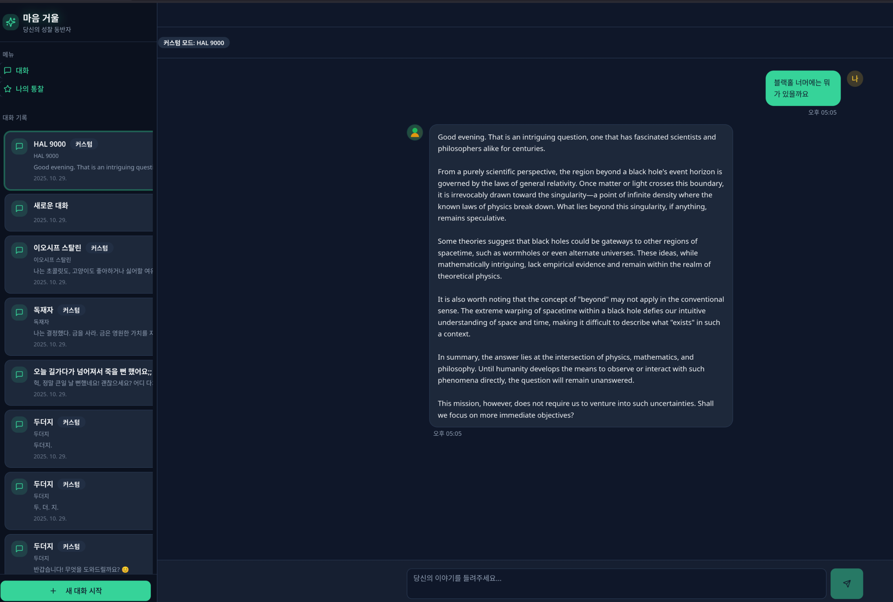

# 마음 거울 (Self Insight Chat)

자기 성찰을 돕는 AI 챗봇 웹 애플리케이션입니다. 비판단적인 대화를 통해 사용자 스스로 내면을 탐색할 수 있도록 안내합니다.

### 사용자 인터페이스





### 기능

- 자기 성찰 질문 흐름과 응답 기록
- 대화 맥락을 반영한 맞춤형 질문 생성
- 반응형 UI와 어두운 테마 지원

## 개발 환경 설정

필수 요구 사항:

- Node.js 18 이상 (권장: [nvm 설치 가이드](https://github.com/nvm-sh/nvm#installing-and-updating))
- npm 9 이상

설치 및 실행:

```sh
npm install
npm run dev
```

개발 서버는 기본적으로 `http://localhost:5173`에서 실행됩니다.

## 프로젝트 구조

- `src/` – React 컴포넌트와 페이지 로직
- `public/` – 정적 자산 (파비콘, OG 이미지 등)
- `vite.config.ts` – 번들러 및 플러그인 설정

## 배포

프로덕션 번들을 생성하려면 다음 명령을 실행하세요.

```sh
npm run build
npm run preview
```

빌드 결과물은 `dist/` 디렉터리에 생성되며, 원하는 호스팅 환경에 업로드하여 배포할 수 있습니다.

### AI Gateway Worker 배포

Cloudflare Worker 프록시는 GitHub Actions로 자동 배포됩니다.

1. GitHub Repository Secrets 설정 (Settings → Secrets and variables → Actions)
   | Secret 이름 | 설명 |
   | --- | --- |
   | `CF_API_TOKEN` | `wrangler deploy` 권한이 있는 Cloudflare API 토큰 |
   | `CF_ACCOUNT_ID` | Cloudflare Account ID |
   | `AI_GATEWAY_SECRET_INTERNAL_KEY` | 백엔드와 통신할 내부 키 |
   | `AI_GATEWAY_SECRET_CALLER_KEY` *(선택)* | Worker → Worker 호출 시 사용 |
   | `AI_GATEWAY_GITHUB_TOKEN` | Upstream 인증에 사용하는 GitHub 토큰 |

2. 워크플로우 `.github/workflows/deploy-ai-check-gateway.yml`
   - `main` 브랜치의 `workers/failure-ai-worker/**` 변경 시 자동 실행
   - Secrets를 `wrangler secret put`로 주입하고 `wrangler deploy` 수행

3. 로컬 테스트
   ```sh
   cd workers/failure-ai-worker
   npm install --global wrangler@3
   wrangler dev
   ```

### 프런트엔드 GitHub Pages 배포

- 커스텀 도메인 `https://ai-failure-chat.nodove.com` 기준으로 Vite `base`가 자동 설정되며, `HashRouter`를 사용해 새로고침 404를 방지합니다.
- GitHub Pages 배포는 `.github/workflows/deploy-pages.yml` 워크플로우로 자동화되어 있습니다.
  - `main` 브랜치에 변경 사항을 푸시하면 빌드 후 Pages에 업로드됩니다.
  - workflow_dispatch로 수동 실행도 가능합니다.
- 수동 빌드/검증
  ```sh
  npm install
  npm run build
  npm run preview
  ```
